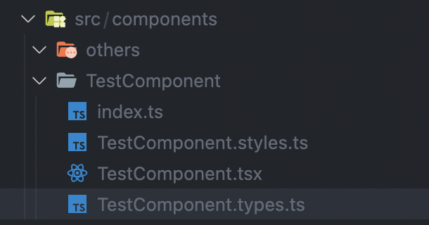

# Root Up


## 🗂 What is Root Up?

This package is built for folder structure generator who has specific folder template.

## 🚗 Installation

```bash
# using yarn
yarn global add root-up
```

```bash
# using npm
npm install -g root-up
```

Note: add --save if you are using npm < 5.0.0

## Before you start

You must make `.template` folder to your root path in workspace
The `.template` folder must be configured as follows

```txt
/.template
   /<templateFolder>
   /<templateFolder>
   ...
   config.json
```

Checkout `.template` folder demo ->

### templateFolder

`/<templateFolder>` ... is your own template.
Make sure check prefix in your config.json

### config.json

The `.config.json` file must be configured as follows

```json
{
  "prefix": "YOUR_FAVORITE_PREFIX",
  "output": "YOUR_DEFAULT_OUTPUT_PATH_IN_YOUR_WORKSPACE"
}
```

**prefix**:
The `prefix` property is the property that sets the alternate text to be replaced by the name of the folder.  
Write down the name of the file, the code used in the template.

**output**:
The `output` property is the property that path to template folder generated _related path_ to your command is executed path

## 🚀 How to run

```bash
root-up
```

Default output location is src/components

So, result is Below




### Case of your Own template

1. make folder in your workspace name `.template`
2. run command

   ```bash
   m-rcfg doc
   ```

3. custom your doc in `.template > template.json`

| Name   | Type   | Default             | Description                                                                                                                    |
| ------ | ------ | ------------------- | ------------------------------------------------------------------------------------------------------------------------------ |
| prefix | string | \_\_M_COMPONENT\_\_ | Specify your component template file <br/> You can custom this file, but if change file name, make sure this value also change |
| output | string | ./src/components    | Define where components folder output Path                                                                                     |

## 🚕 Example

> You can use npx

```bash
npx react-component-folder-generator -n TestComponent
```
