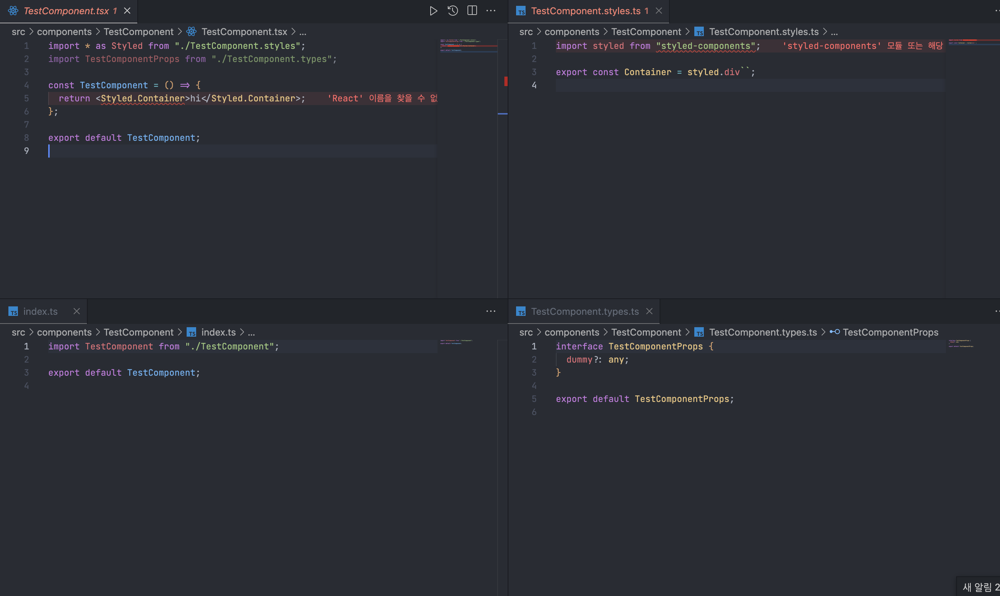

# Root Up


## 🗂 What is Root Up?

This package is built for folder structure generator who has specific folder template.

## 🚗 Installation

```bash
# using yarn
yarn global add root-up
```

```bash
# using npm
npm install -g root-up
```

Note: add --save if you are using npm < 5.0.0

## 🚀 How to run

```bash
root-up
```

Default output location is src/components

So, result is Below




### Case of your Own template

1. make folder in your workspace name `.template`
2. run command

   ```bash
   m-rcfg doc
   ```

3. custom your doc in `.template > template.json`

| Name   | Type   | Default             | Description                                                                                                                    |
| ------ | ------ | ------------------- | ------------------------------------------------------------------------------------------------------------------------------ |
| prefix | string | \_\_M_COMPONENT\_\_ | Specify your component template file <br/> You can custom this file, but if change file name, make sure this value also change |
| output | string | ./src/components    | Define where components folder output Path                                                                                     |

## 🚕 Example

> You can use npx

```bash
npx react-component-folder-generator -n TestComponent
```
